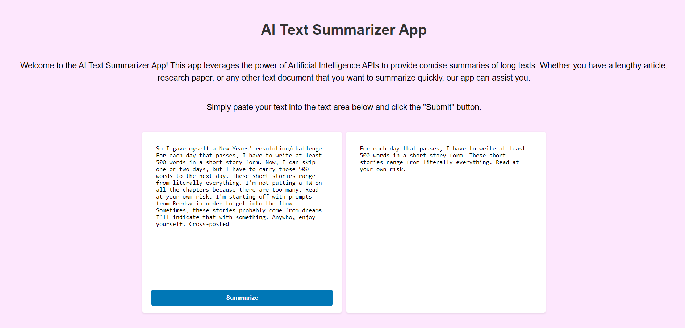

# AI Text Summarization App

Welcome to the AI Text Summarization App! This application leverages advanced machine learning models to generate concise summaries of long texts. It's designed to help you quickly understand the core ideas of any document without having to read through the entire content.

## I hope this link work in replit: https://d3800d19-b872-47fb-92b4-919df57486a9-00-2dz3qz7tzre3v.sisko.replit.dev/
## Images:




## Features

- **Automatic Text Summarization:** Easily summarize any text by pasting it into the app.
- **User-Friendly Interface:** Simple and intuitive design for seamless user experience.
- **Fast and Efficient:** Get summaries in seconds, saving you time and effort.

## How It Works

1. **Input:** Paste the text you want to summarize into the input field.
2. **Processing:** The AI model analyzes the text, identifies key points, and generates a summary.
3. **Output:** The summarized text is displayed on the screen.

## Installation


To run this app locally:

1. Clone the repository:
   ```bash
   git clone https://github.com/lourduradjou/ai-text-summarization-app.git

2. Change the directory:
   ```bash
   cd ai-text-summarization-app

3. Install the required packages:
   ```bash
   npm install

4. **Sign up** in **Hugging Face** and connect via api access token , using the **Facebook-bart-cnn** (This model is used in this repo)

Clone The repo and make contribution and open a pull request , i will check it and merge.
Further Improvements: Adding more interactivity, Changint the UI/UX , or adding a image generation also (I tried still not works well at my case)


